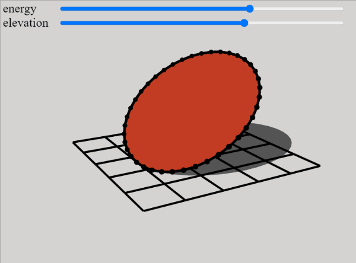

 
# wobbly disc  

# about

this is a fun little project from August 2021.  
i wanted to make a simulation of a freely wobbling disc, but could not figure out the maths.  
instead, i made some simplifications:  

the disc is fixed at its center and tilted such that it touches the ground at exactly one point.  
so there are only two degrees of freedom:  

- elevation of its center  
- angle of "wobble"  

then i derived how fast the disc needs to wobble, given a total energy (potential + kinetic) and an elevation.  

the 3D-renderer was made from scratch (again) with one main feature being the discs shadow.  